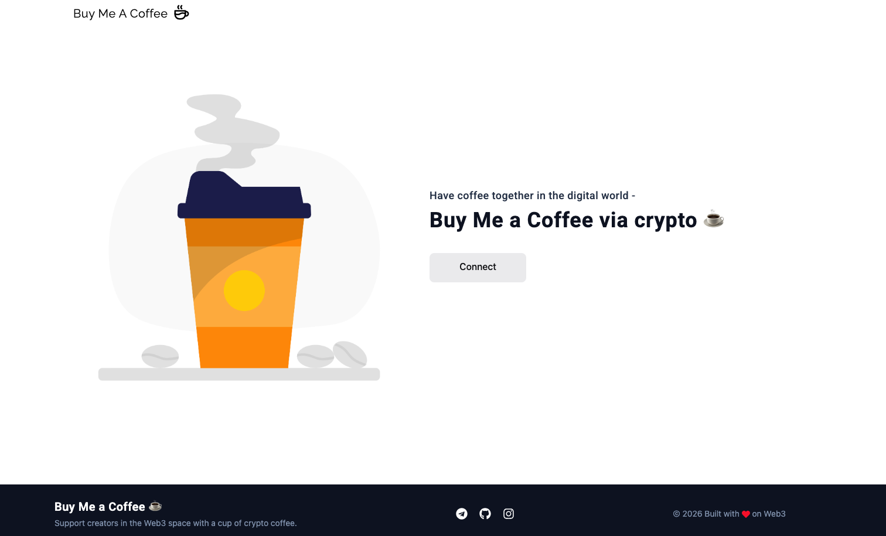
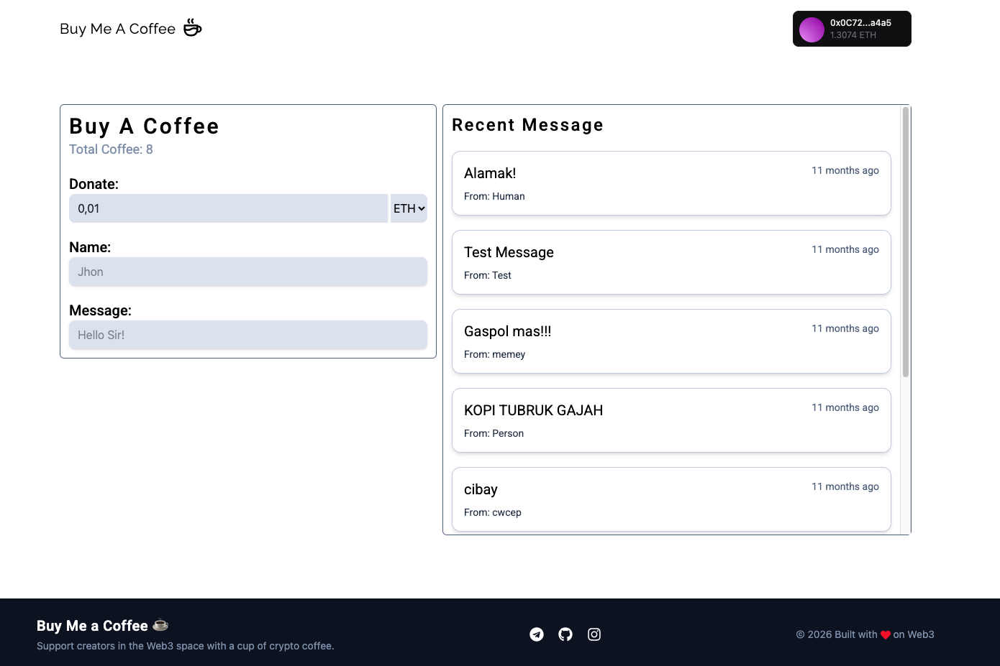
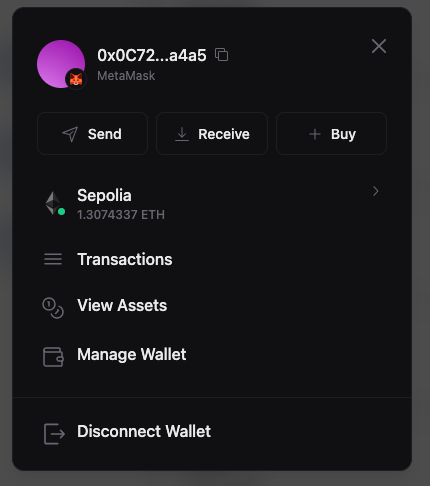

# ☕ Buy Me Coffee DApp

A decentralized application (DApp) that allows users to support creators by sending coffee donations directly through the blockchain. Built with Thirdweb smart contracts and a React.js frontend.

## 🔗 Live Demo

🌐 **Website:** https://buy-me-a-coffee-drab.vercel.app

---

## 📖 Overview

Buy Me Coffee is a Web3 application that enables supporters to send cryptocurrency donations to creators in a transparent and decentralized way.

The application leverages Thirdweb for smart contract deployment and blockchain interactions, while the frontend is built using React.js with the Thirdweb CLI.

---

## ✨ Features

* 🔗 Connect crypto wallet
* ☕ Send coffee donations on-chain
* 📝 Leave a message with each donation
* 📜 View donation history
* ⚡ Fast blockchain interaction using Thirdweb SDK
* 📱 Responsive user interface

---

## 🛠️ Tech Stack

### Frontend

* React.js
* Vite
* Thirdweb React SDK
* CSS / Tailwind CSS

### Blockchain

* Thirdweb
* Solidity Smart Contract
* EVM Compatible Network

### Wallet Integration

* MetaMask

### Network

* Sepolia Testnet

---

## 📸 Screenshots

<h3>Home Page</h3>

<h3>Donation Page</h3>

<h3>Wallet Connected</h3>

---

## 👨‍💻 Author

**Your Name**

* GitHub: https://github.com/satyawiguna2024
* LinkedIn: https://www.linkedin.com/in/i-made-satya-wiguna-076313374/

---

⭐ If you found this project useful, consider giving it a star.
